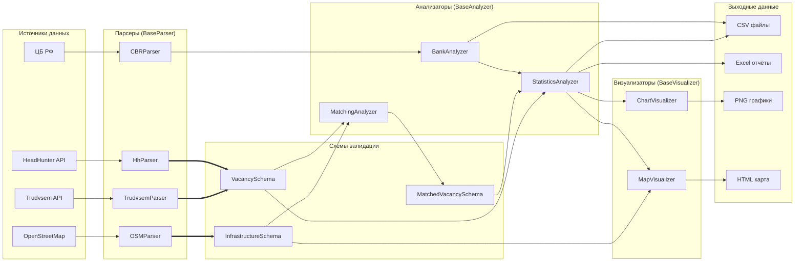

# Анализ рынка труда и инфраструктуры регионов РФ

Аналитическая система для исследования взаимосвязи между рынком труда (вакансии) и объектами инфраструктуры (банки, производства, салоны красоты, магазины) в любом регионе Российской Федерации.

## Архитектура

### Схема данных и потоки



### Принципы SOLID в реализации

| Принцип | Реализация в проекте |
|---------|----------------------|
| **S** (Single Responsibility) | Каждый класс отвечает за одну задачу: парсер → только парсинг, анализатор → только анализ |
| **O** (Open/Closed) | Новые источники данных добавляются через наследование, не изменяя существующий код |
| **L** (Liskov Substitution) | Парсеры вакансий (`TrudvsemParser`, `HhParser`) взаимозаменяемы — оба наследуют `BaseVacancyParser` |
| **I** (Interface Segregation) | Три отдельных абстрактных класса: `BaseParser`, `BaseAnalyzer`, `BaseVisualizer` |
| **D** (Dependency Inversion) | `Pipeline` зависит от абстракций, а не от конкретных реализаций парсеров |

### Контракты данных

Каждый модуль ожидает строго определённый формат данных:

| Модуль | Ожидаемый вход | Ожидаемый выход |
|--------|---------------|-----------------|
| `BaseVacancyParser` | параметры региона | DataFrame с колонками: `id`, `job_name`, `salary_min`, `salary_max`, `experience`, `education`, `employer_name`, `address`, `category`, `lat`, `lon`, `source_date`, `city` |
| `BaseInfrastructureParser` | параметры региона | `Dict[str, DataFrame]` с ключами: `banks`, `industries`, `beauty`, `retail` |
| `BankAnalyzer` | DataFrame банков | DataFrame со статистикой |
| `MatchingAnalyzer` | словарь с вакансиями и инфраструктурой | DataFrame связанных вакансий |
| `StatisticsAnalyzer` | DataFrame вакансий | DataFrame статистики |
| `ChartVisualizer` | DataFrame вакансий | `List[str]` (пути к графикам) |
| `MapVisualizer` | словарь с данными инфраструктуры | `str` (путь к HTML) |

## Установка и запуск

### Для использования

```bash
# 1. Клонирование репозитория
git clone https://github.com/DeafMist/region-data-analysis.git
cd region-data-analysis

# 2. Создание виртуального окружения
python -m venv venv
source venv/bin/activate  # Linux/Mac
# или
venv\Scripts\activate  # Windows

# 3. Установка зависимостей
pip install -r requirements.txt

# 4. Настройка HeadHunter API (опционально, для использования HhParser)
# Создайте файл .env в корне проекта:
echo "HH_CLIENT_ID=ваш_client_id" > .env
echo "HH_CLIENT_SECRET=ваш_client_secret" >> .env
echo "HH_CONTACT_EMAIL=ваша@почта.ru" >> .env

# 5. Запуск пайплайна для Белгородской области (по умолчанию, Trudvsem)
python main.py

# 6. Запуск с использованием HeadHunter
python main.py --parser hh --region belgorod

# 7. Запуск для другого региона (перед этим необходимо сконфигурировать данные по региону в config.py)
python main.py --region voronezh
```

### Доступные парсеры вакансий

| Парсер | Ключ | Источник | Особенности                                                                                 |
|--------|------|----------|---------------------------------------------------------------------------------------------|
| TrudvsemParser | `trudvsem` | trudvsem.ru | Официальные данные, бесплатно, больше вакансий     |
| HhParser | `hh` | hh.ru | Больше данных (координаты, города), OAuth, до 2000 вакансий |

## Описание модулей

| Модуль | Назначение | Особенности                                                              |
|--------|-----------|--------------------------------------------------------------------------|
| **CBRParser** | Загружает список банков с сайта ЦБ РФ | Используется для верификации банков                                      |
| **OSMParser** | Собирает объекты инфраструктуры из OSM | Поддерживает переключение серверов при ошибках                           |
| **TrudvsemParser** | Парсит вакансии с trudvsem.ru | Извлекает город из адреса, координаты из API                             |
| **HhParser** | Парсит вакансии с hh.ru | OAuth 2.0, кэширование токена, координаты, города                        |
| **BankAnalyzer** | Анализирует распределение банков | Разделяет банки и банкоматы, верификация по ЦБ                           |
| **MatchingAnalyzer** | Связывает вакансии с объектами | По названию работодателя и расстоянию                                    |
| **StatisticsAnalyzer** | Рассчитывает статистику | Агрегирует по городам, категориям, объектам                              |
| **ChartVisualizer** | Генерирует 16 типов графиков | Включает распределение по городам и зарплатам                            |
| **MapVisualizer** | Создаёт интерактивную карту | Точки инфраструктуры с профессиональным составом, тепловая карта зарплат |

## Расширение системы

### Добавление нового региона

В `config.py` в словарь `REGIONS` добавьте новый регион:

```python
REGIONS["novgorod"] = {
    "name": "Новгородская область",
    "name_ru": "Новгородская область", 
    "code_trudvsem": "5300000000000",  # Код для Trudvsem API (пример)
    "code_hh": 1234,                   # ID для HeadHunter API (пример)
    "center_lat": 58.521,
    "center_lon": 31.275,
    "zoom_start": 9,
    "cities": ["Великий Новгород", "Боровичи", "Старая Русса"],
    "osm_place": "Новгородская область, Россия",
}
```

Затем запустите:

```bash
python main.py --region novgorod --parser trudvsem
```

### Смена источника вакансий

Замена Trudvsem на HeadHunter:

```bash
python main.py --parser hh --region belgorod
```

В коде это выглядит так:

```python
from parsers.hh_parser import HhParser

pipeline = Pipeline(region="belgorod", vacancy_parser_class=HhParser)
```

Оба парсера реализуют одинаковый интерфейс `BaseVacancyParser` и возвращают данные в едином формате `VacancySchema`.

### Создание нового парсера вакансий

```python
from core.parser import BaseVacancyParser
from core.schemas import VacancySchema
from utils.text_helpers import extract_city_from_address

class MyCustomParser(BaseVacancyParser):
    def __init__(self, region: str = None):
        super().__init__("my_parser", region)
    
    def _parse_impl(self, **kwargs) -> pd.DataFrame:
        # Ваша логика парсинга
        return df
```

### Создание нового анализатора

```python
from core.analyzer import BaseAnalyzer
from core.schemas import VacancySchema

class MyAnalyzer(BaseAnalyzer):
    def __init__(self, region: str = None):
        super().__init__("my_parser", region)
    
    def analyze(self, data: Any, **kwargs) -> Any:
        # Валидация входных данных
        VacancySchema.validate(data)
        
        # Анализ
        return results
```

### Создание нового визуализатора

```python
from core.visualizer import BaseVisualizer

class MyVisualizer(BaseVisualizer):
    def __init__(self, region: str = None):
        super().__init__("my_viz", region)
    
    def visualize(self, data: Any, **kwargs) -> Optional[Union[str, List[str]]]:
        region_prefix = self.region or "unknown"
        filepath = f"data/charts/{region_prefix}_my_chart.png"
        # ... создание визуализации ...
        return filepath
```

## Пример использования

### Команда запуска

```bash
# Использование Trudvsem
python main.py --region belgorod --parser trudvsem

# Использование HeadHunter
python main.py --region belgorod --parser hh
```

## Логирование

Логи выводятся в консоль с уровнями INFO, WARNING, ERROR.

### Настройка логирования

В файле `config.py` можно изменить:

```python
LOG_LEVEL = "DEBUG"      # Для отладки (DEBUG, INFO, WARNING, ERROR)
LOG_FORMAT = "%(asctime)s - %(name)s - %(levelname)s - %(message)s"
```

## Тестирование

Для обеспечения надёжности и корректности работы системы разработан набор автоматических тестов с использованием фреймворка `pytest`.

### Запуск тестов

```bash
# Запуск всех тестов с отчётом о покрытии
pytest --cov=. --cov-report=term --tb=no -q

# Запуск только юнит-тестов
pytest tests/unit/ -v

# Запуск только интеграционных тестов
pytest tests/integration/ -v

# Запуск с генерацией HTML-отчёта о покрытии
pytest --cov=. --cov-report=html
```
